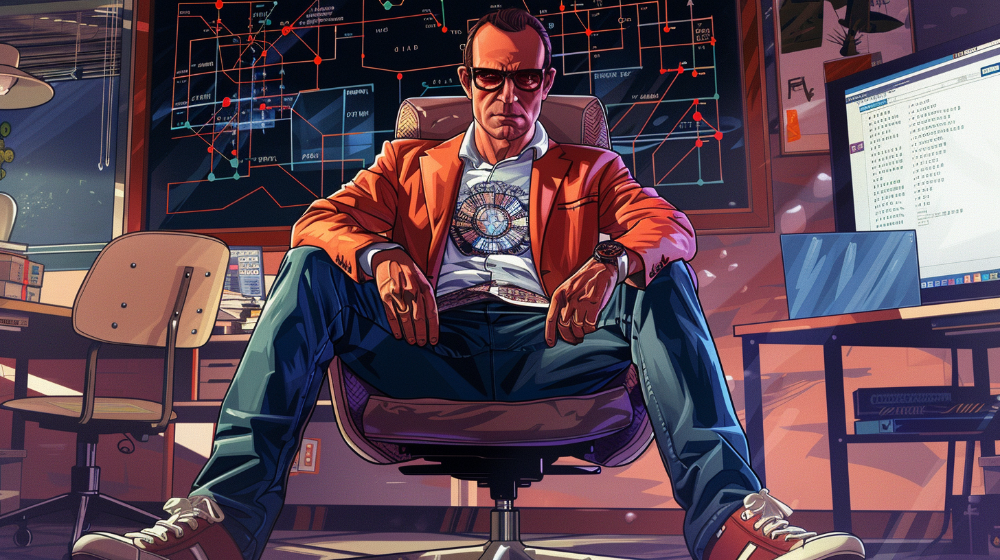

## Ada Lovelace (1815–1852)

Often celebrated as the world’s first computer programmer, Ada Lovelace wrote the first algorithm intended to be executed by Charles Babbage's Analytical Engine.

<a href="https://en.wikipedia.org/wiki/Ada_Lovelace" target="_blank">Augusta Ada King - Wikipedia</a>

## Alan Turing (1912–1954)

Often considered the father of theoretical computer science and artificial intelligence, Turing's work on the Turing machine forms the basis of modern computer theory.

<a href="https://en.wikipedia.org/wiki/Alan_Turing" target="_blank">Alan Mathison Turing - Wikipedia</a>

## Barbara Liskov (b. 1939)

A computer scientist who was awarded the Turing Award for her work in the design of programming languages and software methodology that led to the development of object-oriented programming.

## Claude Shannon (1916–2001)

Known as the "father of information theory," Shannon's work laid the groundwork for digital circuit design theory and telecommunications.

## Donald Knuth (b. 1938)

An expert in algorithms and the author of "The Art of Computer Programming," Knuth's work has been influential in the development of the field.

## Edsger W. Dijkstra (1930–2002)

A pioneer in many areas of computer science, Dijkstra is known for his work on algorithm design and his contributions to the discipline of programming as a high-level engineering profession.

## Frances E. Allen (1932–2020)

A pioneer in the field of compiler optimization, Allen became the first woman to win the Turing Award, which is often referred to as the "Nobel Prize of Computing."

## Grace Hopper (1906–1992)

A rear admiral in the U.S. Navy, Hopper was a pioneer of computer programming who invented one of the first compiler-related tools. She played a significant role in the development of COBOL, one of the earliest high-level programming languages.

## Hedy Lamarr (1914–2000)

While primarily known as a film actress, Lamarr was also a co-inventor of an early technique for spread spectrum communications, a key to modern wireless communication technology.

## Joan Clarke (1917–1996)

A codebreaker who worked alongside Alan Turing at Bletchley Park during World War II, contributing to decrypting the Enigma code.

## John von Neumann (1903–1957)

Made foundational contributions to the development of digital computers, including the concept of the von Neumann architecture, which is still used in most computers today.

<a href="https://en.wikipedia.org/wiki/John_von_Neumann" target="_blank">John von Neumann - Wikipedia</a>

## Karen Spärck Jones (1935–2007)

A pioneer in information retrieval and natural language processing, Jones developed the concept of inverse document frequency, a key to search engine technology.

## Katherine Johnson (1918–2020)

A mathematician whose work for NASA included calculating trajectories for the Mercury and Apollo missions. Her story was popularized in the film "Hidden Figures."

## Ken Thompson (b. 1943) and Dennis Ritchie (1941–2011)

Co-creators of UNIX, an operating system that has had a profound influence on the development of software and programming languages. Ritchie also created the C programming language, one of the most widely used languages today.

## Linus Torvalds (b. 1969)

The creator of Linux, an open-source operating system kernel that powers millions of servers, desktops, and mobile devices around the world.

## Margaret Hamilton (b. 1936)

As the director of the Software Engineering Division of the MIT Instrumentation Laboratory, Hamilton developed the onboard flight software for NASA's Apollo missions, including the historic Apollo 11 moon landing.

<a href="https://en.wikipedia.org/wiki/Margaret_Hamilton_(software_engineer)" target="_blank">Margaret Elaine Hamilton - Wikipedia</a>

## Radia Perlman (b. 1951)

Known as the "mother of the Internet," Perlman invented the spanning-tree protocol (STP), which is fundamental to the operation of network bridges.

## Richard Stallman (b. 1953)

Founder of the Free Software Movement, Stallman initiated the development of the GNU operating system, which, together with the Linux kernel, is used widely in its variants.

## Tim Berners-Lee (b. 1955)

Inventor of the World Wide Web, Berners-Lee has been a pivotal figure in making the internet accessible and usable for people worldwide.

## Vint Cerf (b. 1943) and Robert Kahn (b. 1938)

Known as the "fathers of the Internet," they co-designed TCP/IP protocols and the architecture of the Internet.
