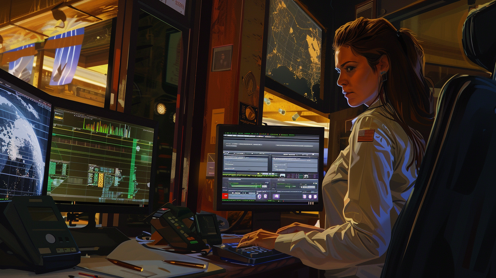

# Our Super Heroes

Our very own pantheon of pioneers and visionaries. Here, in the unique universe of Repo Racers, we pay homage to the extraordinary minds that have laid the foundational stones of the digital world we thrive in today. Each character, reinvented in their prime within our imaginative universe, represents the brilliance, perseverance, and creativity that drive us forward.

Our Coding Dream Team stands as a testament to the power of innovation and the unyielding spirit of discovery. These are the trailblazers who first dared to dream about the future of computing, from the mystical algorithms of Ada Lovelace to the visionary architecture of John von Neumann, and the groundbreaking contributions of Tim Berners-Lee that wove the World Wide Web into the fabric of society.

Crafted with a blend of artistry and reverence, our stylized portrayals capture the essence of each hero in a manner that transcends time and technology. They are not just figures of the past but beacons that guide us in the labyrinth of codes and circuits, reminding us of the humanity behind the hardware, the dreams encoded in every line of software.

As you navigate through this website, let this dream team of innovation inspire you. May the courage of Grace Hopper, the brilliance of Alan Turing, and the creativity of Linus Torvalds fuel your imagination and ambition. In the Repo Racers universe, these icons are not relics of history but vibrant mentors urging us to push boundaries, innovate relentlessly, and code with purpose.

## Ada Lovelace (1815–1852)

Often celebrated as the world’s first computer programmer, Ada Lovelace wrote the first algorithm intended to be executed by Charles Babbage's Analytical Engine.

<a href="https://en.wikipedia.org/wiki/Ada_Lovelace" target="_blank">Augusta Ada King - Wikipedia</a>

## Alan Turing (1912–1954)

Often considered the father of theoretical computer science and artificial intelligence, Turing's work on the Turing machine forms the basis of modern computer theory.

<a href="https://en.wikipedia.org/wiki/Alan_Turing" target="_blank">Alan Mathison Turing - Wikipedia</a>

## Barbara Liskov (b. 1939)

A computer scientist who was awarded the Turing Award for her work in the design of programming languages and software methodology that led to the development of object-oriented programming.

<a href="https://en.wikipedia.org/wiki/Barbara_Liskov" target="_blank">Barbara Liskov - Wikipedia</a>

## Claude Shannon (1916–2001)

Known as the "father of information theory," Shannon's work laid the groundwork for digital circuit design theory and telecommunications.

<a href="https://en.wikipedia.org/wiki/Claude_Shannon" target="_blank">Claude Shannon - Wikipedia</a>

## Edsger W. Dijkstra (1930–2002)

A pioneer in many areas of computer science, Dijkstra is known for his work on algorithm design and his contributions to the discipline of programming as a high-level engineering profession.

<a href="https://en.wikipedia.org/wiki/Edsger_W._Dijkstra" target="_blank">Edsger W. Dijkstra  - Wikipedia</a>

## Frances E. Allen (1932–2020)

A pioneer in the field of compiler optimization, Allen became the first woman to win the Turing Award, which is often referred to as the "Nobel Prize of Computing."

<a href="https://en.wikipedia.org/wiki/Frances_Allen" target="_blank">Frances E. Allen - Wikipedia</a>

## Grace Hopper (1906–1992)

A rear admiral in the U.S. Navy, Hopper was a pioneer of computer programming who invented one of the first compiler-related tools. She played a significant role in the development of COBOL, one of the earliest high-level programming languages.

<a href="https://en.wikipedia.org/wiki/Grace_Hopper" target="_blank">Grace Hopper - Wikipedia</a>

## Hedy Lamarr (1914–2000)

While primarily known as a film actress, Lamarr was also a co-inventor of an early technique for spread spectrum communications, a key to modern wireless communication technology.

<a href="https://en.wikipedia.org/wiki/Hedy_Lamarr" target="_blank">Hedy Lamarr - Wikipedia</a>

## Jaron Lanier (b. 1960))

Visual artist, computer philosophy writer, technologist, futurist, and composer of contemporary classical music. Considered a founder of the field of virtual reality.

<a href="https://en.wikipedia.org/wiki/Jaron_Lanier" target="_blank">Jaron Lanier - Wikipedia</a>

## Joan Clarke (1917–1996)

A codebreaker who worked alongside Alan Turing at Bletchley Park during World War II, contributing to decrypting the Enigma code.

<a href="https://en.wikipedia.org/wiki/Joan_Clarke" target="_blank">Joan Clarke - Wikipedia</a>

## John von Neumann (1903–1957)

Made foundational contributions to the development of digital computers, including the concept of the von Neumann architecture, which is still used in most computers today.

<a href="https://en.wikipedia.org/wiki/John_von_Neumann" target="_blank">John von Neumann - Wikipedia</a>

## Karen Spärck Jones (1935–2007)

A pioneer in information retrieval and natural language processing, Jones developed the concept of inverse document frequency, a key to search engine technology.

<a href="https://en.wikipedia.org/wiki/Karen_Sp%C3%A4rck_Jones" target="_blank">Karen Spärck Jones - Wikipedia</a>

## Katherine Johnson (1918–2020)

A mathematician whose work for NASA included calculating trajectories for the Mercury and Apollo missions. Her story was popularized in the film "Hidden Figures."

<a href="https://en.wikipedia.org/wiki/Katherine_Johnson" target="_blank">Katherine Johnson - Wikipedia</a>

## Dennis Ritchie (1941–2011)

Co-creator of UNIX with Ken Thompson, an operating system that has had a profound influence on the development of software and programming languages. Ritchie also created the C programming language, one of the most widely used languages today.

<a href="https://en.wikipedia.org/wiki/Dennis_Ritchie" target="_blank">Dennis Ritchie - Wikipedia</a>

## Linus Torvalds (b. 1969)

The creator of Linux, an open-source operating system kernel that powers millions of servers, desktops, and mobile devices around the world.

<a href="https://en.wikipedia.org/wiki/Linus_Torvalds" target="_blank">Linus Torvalds - Wikipedia</a>

## Margaret Hamilton (b. 1936)

As the director of the Software Engineering Division of the MIT Instrumentation Laboratory, Hamilton developed the onboard flight software for NASA's Apollo missions, including the historic Apollo 11 moon landing.

<a href="https://en.wikipedia.org/wiki/Margaret_Hamilton_(software_engineer)" target="_blank">Margaret Elaine Hamilton - Wikipedia</a>

## Richard Stallman (b. 1953)

Founder of the Free Software Movement, Stallman initiated the development of the GNU operating system, which, together with the Linux kernel, is used widely in its variants.

<a href="https://en.wikipedia.org/wiki/Richard_Stallman" target="_blank">Richard Stallman - Wikipedia</a>
