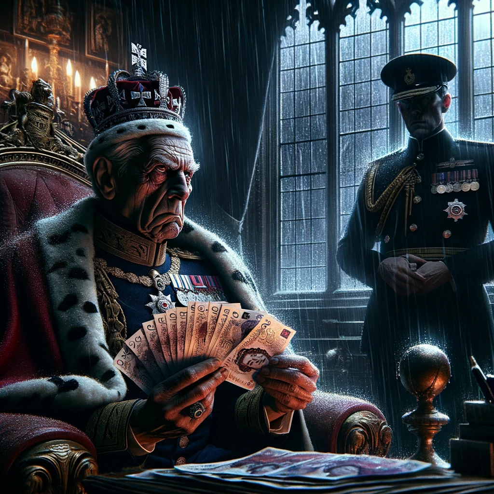

# "Bankrupt Britain": A Repo Racers Graphic Novel

## A Bold Fusion of Technology, Creativity, and Social Commentary

Welcome to an exhilarating venture by Repo Racers, where we break the mold to bring you "Bankrupt Britain," a graphic novel that encapsulates the essence of our technological prowess, creative ambition, and insightful commentary on societal issues.

This project is not just a narrative; it's a demonstration of our team's ability to harness the latest in GitHub, OpenAI, and Midjourney innovations, blending cutting-edge technology with compelling storytelling.

## Synopsis

> In the shadow-streaked corners of 'Bankrupt Britain,' a simmering fury boils within the hearts of those betrayed and burdened by the insatiable greed of the generations before them. Boomers, in their reckless pursuit of excess, have shackled their children and grandchildren with chains of debt so dense, the air reeks of despair.

> This isn't just resentment; it's a declaration of war.

> At the forefront of this new age stands the Zero Debt Hacktivists, a cadre of razor-sharp activists, the spearhead of a disenfranchised generation. They've witnessed the pillage of their future, seen their dreams auctioned off to the highest bidder, and they're not standing for it any longer. With a fire in their bellies and fury in their eyes, they plot the ultimate act of rebellion: a mass bankruptcy declaration.

> And then, the unthinkable: the entire UK population below the age of 35 stands united, declaring bankruptcy on the same cataclysmic day. Orchestrated by the Zero Debt Hacktivists, this collective defiance sends the pound into freefall and resets the debt clock to null. The establishment quakes as their empire of cards collapses, a nation's chains shattered by the very ones they sought to enslave.

> 'Bankrupt Britain' isn't just a story; it's a gritty, raw testament to the power of collective action against the juggernaut of generational greed. It's a wake-up call, ringing loud in the silent aftermath, a question hanging in the balance: What comes after the dust settles?

## Our Mission: More Than Just a Story

At Repo Racers, we believe in pushing the boundaries of what's possible. "Bankrupt Britain" is our ambitious project that showcases our team's collaborative spirit and technical skills, all while delivering a powerful message about generational responsibility and economic disparity. Through this graphic novel, we aim to:

- **Showcase Technical Excellence:** Utilizing CI/CD GitHub actions and custom-built integrations, we exemplify how technology can streamline creative processes, setting a new standard for graphic novel production.
- **Foster Creativity:** By giving our crew a unique platform to express their ideas, we're not just creating a story; we're igniting a dialogue on pressing societal issues, proving that technology and art can go hand in hand.
- **Demonstrate Collaboration:** This project is a testament to our team's collaborative effort, leveraging diverse skills across programming, design, and storytelling to create something truly groundbreaking.

## Why This Matters

In creating "Bankrupt Britain," we're doing more than telling a story. We're setting a precedent for how technology can be used to amplify creative voices and tackle complex issues. This graphic novel serves as a showcase of our expertise in GitHub, OpenAI, and beyond, illustrating the potential for tech-driven storytelling and its impact on society.
