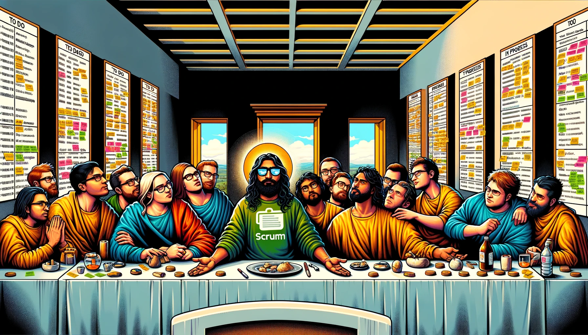

# Scrum Getting Started

Welcome to the foundational starting point for our crew's journey through the world of Scrum and Agile methodologies. This guide is tailor-made for us, whether we're embarking on this path for the first time or looking to deepen our collective understanding.

With Scrum as our foundation framework, we focus on fostering teamwork, accountability, and iterative progress towards clearly defined goals. It provides us with a structured, yet adaptable, approach to managing our complex projects.

- [The Basics](./basics/backlog_management.md): Begin our adventure by delving into the Agile methodology, understanding its core values, and principles.
- [How We Ship](./how_we_ship/how_we_ship.md): Discover the foundational elements that make us an effective crew, including our roles, responsibilities, and what we expect from each other.
- [Beyond The Basics](./beyond_the_basics/backlog_management.md): Advance our knowledge with deeper insights into Agile and Scrum practices, learning new tools and techniques to tackle our upcoming challenges.
